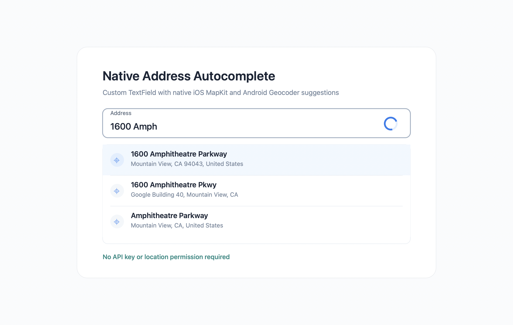

# native_address_autocomplete

A customizable Flutter address autocomplete TextField powered by native platform APIs.



## Features

- No Google API key required.
- No Apple MapKit key required.
- No location permission required.
- iOS uses Apple MapKit `MKLocalSearchCompleter`.
- Android uses the platform `Geocoder`.
- Includes a TextField-style widget with a dropdown.
- Customize debounce, minimum characters, result limit, countries, dropdown height,
  item UI, and the full suggestions list.
- Shows a trailing loading indicator while searching.
- Optional clear button, error UI, keyboard navigation, and matched-text highlight.
- Resolve a selected suggestion into coordinates and address components.
- Optional `FormField` and external state controller.
- Use the system language by default, or pass a custom locale where supported.

Android `Geocoder` is best-effort and depends on the device's available
geocoding service. It is useful for lightweight address suggestions, but it is
not a full replacement for Google Places Autocomplete in delivery-critical
flows. Some emulators, AOSP devices, or devices without a working geocoding
backend may return few or no results.

## Requirements

- Flutter 3.19.0 or newer
- Dart 3.3.0 or newer
- Android minSdk 24 or newer
- iOS 13.0 or newer
- Android uses Java 17-compatible builds
- iOS uses Swift 5.0-compatible builds

## Usage

```dart
NativeAddressAutocompleteTextField(
  addressController: AddressAutocompleteController(),
  countries: const ['US', 'CA'],
  limit: 5,
  dropdownMaxHeight: 280,
  showLoadingIndicator: true,
  showClearButton: true,
  resolveOnSelected: true,
  useSystemLocale: true,
  // Android applies this locale to Geocoder. iOS MapKit follows system/app
  // language and ignores per-request locale overrides.
  locale: const Locale('fr', 'CA'),
  resultTypes: const {
    AddressResultType.address,
    AddressResultType.pointOfInterest,
  },
  decoration: const InputDecoration(
    labelText: 'Address',
    border: OutlineInputBorder(),
  ),
  itemBuilder: (context, suggestion, index) {
    return ListTile(
      title: Text(suggestion.primaryText),
      subtitle: suggestion.secondaryText == null
          ? null
          : Text(suggestion.secondaryText!),
    );
  },
  onSelected: (suggestion) {
    debugPrint(suggestion.fullText);
  },
  onError: (error) {
    debugPrint('Address autocomplete failed: $error');
  },
  onResolved: (address) {
    debugPrint(address.city);
    debugPrint('${address.latitude}, ${address.longitude}');
  },
  errorBuilder: (context, error) {
    return const Padding(
      padding: EdgeInsets.all(16),
      child: Text('Could not load suggestions.'),
    );
  },
)
```

Use it inside a `Form`:

```dart
final formKey = GlobalKey<FormState>();

Form(
  key: formKey,
  child: NativeAddressAutocompleteFormField(
    showClearButton: true,
    validator: (address) {
      return address == null ? 'Address required' : null;
    },
    onSaved: (address) {
      debugPrint(address?.fullText);
    },
  ),
)
```

Customize the trailing loading indicator:

```dart
NativeAddressAutocompleteTextField(
  loadingIndicatorBuilder: (context) {
    return const Padding(
      padding: EdgeInsets.all(12),
      child: CircularProgressIndicator.adaptive(strokeWidth: 2),
    );
  },
)
```

You can also use the client directly:

```dart
const autocomplete = NativeAddressAutocomplete();

final available = await autocomplete.isAvailable();

final suggestions = await autocomplete.suggest(
  '1600 Amph',
  countries: const ['US'],
  limit: 5,
  resultTypes: const {AddressResultType.address},
  localeTag: 'zh-Hant-TW',
);

final address = await autocomplete.resolve(suggestions.first);

debugPrint(address?.street);
debugPrint(address?.postalCode);
```

The dropdown opens below the text field. If there is not enough room, it uses
the available height and scrolls its contents.

## Platform notes

| Feature | iOS | Android |
| --- | --- | --- |
| Provider | Apple MapKit `MKLocalSearchCompleter` + `MKLocalSearch` | Android `Geocoder` |
| API key | Not required | Not required |
| Location permission | Not required | Not required |
| Country filter | Applied through MapKit region/result filtering where possible | Best-effort filtering after Geocoder results |
| Result limit | Applied | Applied after Geocoder returns results |
| Result types | Address and point-of-interest filtering | Not exposed by Android Geocoder; accepted but best-effort |
| Locale | System/app language; per-request overrides are not guaranteed by MapKit | `locale` / `localeTag` is passed to `Geocoder` |
| Address components | Best available from `MKPlacemark` | Best available from `Address` |
| Coordinates | Returned after resolution | Returned when Geocoder provides them |

## Error handling

Use `errorBuilder` to customize the dropdown error UI and `onError` to log or
surface failures outside the widget.

```dart
NativeAddressAutocompleteTextField(
  onError: (error) {
    debugPrint('Address lookup failed: $error');
  },
  errorBuilder: (context, error) {
    return const Padding(
      padding: EdgeInsets.all(16),
      child: Text('Try again in a moment.'),
    );
  },
)
```
